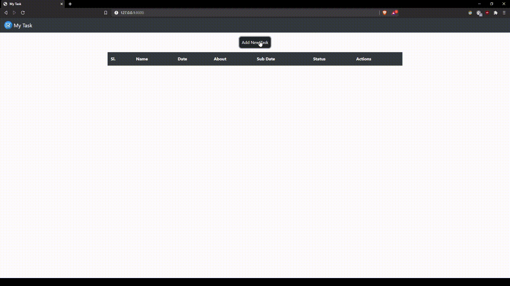

# Quick Demo


# Setup

## Download & Install Python:
## <a href="https://www.python.org/downloads/">Python</a>

## Install Django:
```bash
pip install Django
```

## Migrate:
```bash
python manage.py migrate
```

## Run Development Server

```bash
python manage.py runserver
```
## Public endpoint is at http://127.0.0.1:8000/